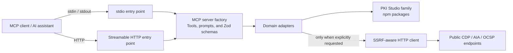
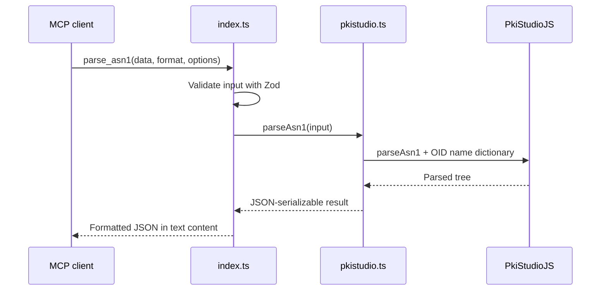
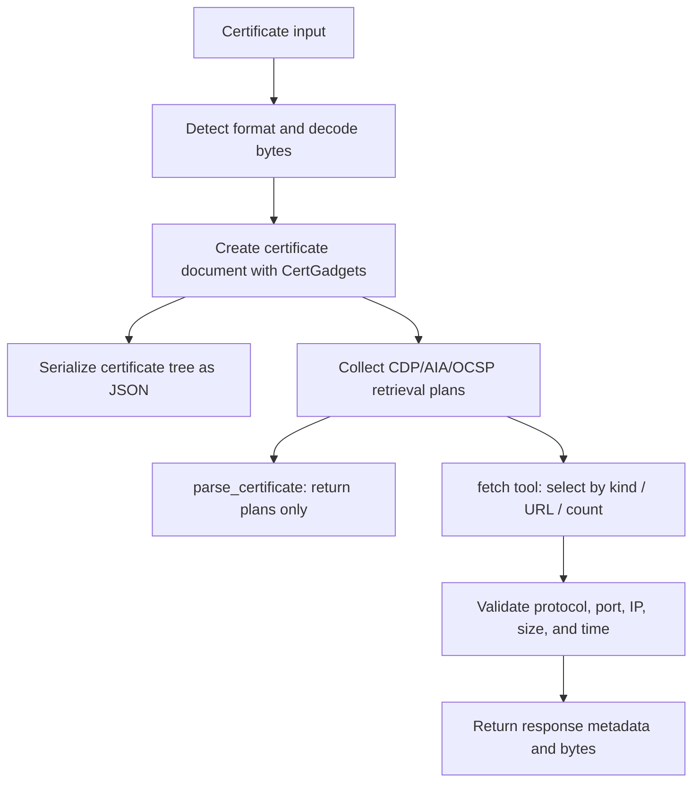

# Architecture Design

## 1. Purpose and System Boundary

PKI Studio MCP is a local-first server that lets AI assistants use PKI Studio family capabilities over MCP. It provides ASN.1 structure parsing, X.509 certificate parsing, key recognition, generation and matching, CSR and self-signed certificate generation, PKCS#12 input/output, DER generation from ASN.1 definitions, and ASN.1 type candidate identification.

The system is responsible for:

- Registering MCP tools and workflow prompts
- Validating MCP input types and ranges with Zod
- Converting between textual PKI representations and byte arrays
- Calling PKI Studio family libraries
- Shaping results as JSON that AI assistants can consume
- Providing stdio and Streamable HTTP transports
- Explicit, restricted retrieval of certificate-related network resources

Certificate authority operations, certificate lifecycle management, persistent secret storage, an audit-log platform, TLS termination, and rate limiting are outside the system boundary.

## 2. System Context

## 3. Logical Components

| Module | Responsibility | Primary dependencies |
| --- | --- | --- |
| `src/index.ts` | MCP server creation, registration of 28 tools and three prompts, Zod input schemas, and stdio startup | MCP SDK, Zod, all adapters |
| `src/http.ts` | HTTP configuration, routing, optional Bearer authentication, CORS, health endpoints, and Streamable HTTP connection | MCP SDK, `src/index.ts` |
| `src/pkistudio.ts` | ASN.1 parsing, summaries and node operations, OID conversion and resolution, and shared byte conversion | `@pkistudio/pkistudiojs` |
| `src/certificates.ts` | X.509 certificate tree shaping, CDP/AIA/OCSP plan collection, and explicit external retrieval | `@pkistudio/certgadgets`, `src/safe-fetch.ts` |
| `src/key-material.ts` | Key recognition, generation and matching; CSR and self-signed certificate generation; PKCS#12 input/output | `@pkistudio/pvkgadgets`, `asn1js` |
| `src/asn1-builder.ts` | ASN.1 definition parsing, schema/instance validation, and DER generation | `@pkistudio/asn1instancebuilder` |
| `src/asn1-defsifter.ts` | ASN.1 type candidate scoring and PKI profile filtering | `@pkistudio/asn1defsifter` |
| `src/safe-fetch.ts` | HTTP(S) retrieval, destination and port restrictions, DNS result pinning, and redirect, size, and time limits | Node.js HTTP/DNS APIs |

Dependencies flow in one direction from the MCP boundary to domain adapters and then to PKI Studio family libraries. Because `src/http.ts` also uses `createPkiStudioMcpServer` from `src/index.ts`, tool definitions do not diverge between transports.

## 4. Runtime Topology

### 4.1 stdio

1. The `pkistudiomcp` command starts `dist/index.js`.
2. The OID name dictionary is loaded lazily and cached in the process.
3. `createPkiStudioMcpServer()` registers tools and prompts.
4. The server connects to `StdioServerTransport`.
5. The MCP SDK dispatches requests received over standard input/output to tool handlers.

stdio is intended primarily for local MCP clients. Startup and error messages are written to standard error so they do not interfere with the protocol on standard output.

### 4.2 Streamable HTTP

1. The `pkistudiomcp-http` command starts `dist/http.js`.
2. The process reads the bind address, MCP path, authentication, CORS, and limits from environment variables.
3. `/healthz` and `/readyz` return `{ "ok": true }`.
4. On the configured MCP path, the server checks authentication and the declared Content-Length.
5. A new MCP server and `StreamableHTTPServerTransport` are created for each request, then the server is closed when the response closes.

The HTTP transport uses `sessionIdGenerator: undefined` and retains no server-side MCP session. Each request is therefore processed independently.

## 5. Major Data Flows

### 5.1 ASN.1 Parsing

Node IDs returned by `parse_asn1` are passed together with the same input data to `describe_node`, `extract_asn1_node`, and `asn1_node_value`. The server does not retain parsed results in a session.

### 5.2 Certificate Parsing and Network Retrieval

`parse_certificate` returns the certificate tree, network resources, and retrieval plans without performing network access. External requests occur only when the separate `fetch_certificate_network_resources` tool is called.

Resources are fetched sequentially in plan order. Retrieved certificates, CRLs, and OCSP responses are not automatically validated or incorporated into a certificate chain.

### 5.3 Key and Certificate Operations

- Key input is treated as a PKCS#8 private key or SPKI public key.
- Key generation uses the WebCrypto capabilities of the running Node.js runtime and returns PKCS#8 and SPKI.
- Private/public key matching signs and verifies sample data.
- Certificate/public-key matching compares SPKI DER bytes; certificate/private-key matching signs and verifies data.
- CSR and self-signed certificate generation use the supplied private key, public key, Subject DN, and hash algorithm.
- PKCS#12 read results include key material and certificate bytes. PKCS#12 writing bundles one or more private keys with optional certificates.

## 6. Data Representation

- MCP input is JSON, and binary values are passed as strings.
- Input formats are generally selected from `auto`, `der`, `ber`, `pem`, `base64`, `headerless-pem`, and `hex`.
- Binary output uses `hex` or `base64`, with defaults defined by each tool.
- Tool results are returned as an indented JSON string in a single MCP `text` content item.
- Certificate document timestamps are returned as ISO 8601 strings.
- The OID name dictionary is loaded from `oids.json` in `@pkistudio/pkistudiojs` on first use and reused within the process. If loading fails, the implementation falls back to an empty dictionary.

## 7. State and Concurrency

- No database, file persistence, or external cache is used.
- The only application state is the in-process OID name dictionary cache.
- stdio uses one MCP server for the lifetime of the process.
- HTTP creates a new MCP server for every request.
- Certificate network resources are fetched sequentially within a single tool call.

## 8. Extension Principles

- Keep tool registration and Zod schemas in `createPkiStudioMcpServer()` so changes reach both transports.
- Put PKI logic in the corresponding adapter module and keep protocol-boundary concerns in `src/index.ts`.
- Separate any operation that performs external communication from local-processing tools, and make network access explicit in its tool name and description.
- Apply depth, count, size, or preview limits to large binary values and trees.
- When updating PKI Studio family dependencies, review supported behavior, tool descriptions, smoke tests, and README/Wiki documentation.
