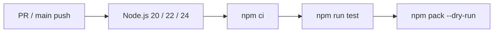

# Deployment and Operations Design

## 1. Runtime Requirements

- Node.js 20 or later
- npm package: `@pkistudio/pkistudiomcp`
- Module format: ESM / NodeNext
- TypeScript output target: ES2022
- No persistent volume, database, or external cache required

The package exposes two CLIs.

| CLI | Entry point | Transport |
| --- | --- | --- |
| `pkistudiomcp` | `dist/index.js` | stdio |
| `pkistudiomcp-http` | `dist/http.js` | Streamable HTTP |

## 2. stdio Deployment

This is the recommended local execution mode.

```sh
npx -y @pkistudio/pkistudiomcp
```

For a local checkout, build first and configure the MCP client with an absolute path.

```sh
npm install
npm run build
node /absolute/path/to/pkistudiomcp/dist/index.js
```

Because stdio uses standard input/output for the MCP protocol, ordinary logs go to standard error. The MCP client is responsible for process supervision and restart.

## 3. HTTP Deployment

```sh
npx -y --package @pkistudio/pkistudiomcp pkistudiomcp-http
```

The default URLs are:

```text
MCP:    http://127.0.0.1:3000/mcp
Live:   http://127.0.0.1:3000/healthz
Ready:  http://127.0.0.1:3000/readyz
```

On `SIGINT` or `SIGTERM`, the process stops accepting new connections, closes the HTTP server, and exits. The current implementation has no forced-shutdown timeout.

### 3.1 Environment Variables

| Variable | Default | Description |
| --- | --- | --- |
| `PKISTUDIOMCP_HTTP_HOST` | `127.0.0.1` | Bind address |
| `PKISTUDIOMCP_HTTP_PORT` | `3000` | Port from 1 through 65535 |
| `PKISTUDIOMCP_HTTP_PATH` | `/mcp` | MCP endpoint; leading and trailing slashes are normalized |
| `PKISTUDIOMCP_HTTP_BEARER_TOKEN` | Unset | When set, requires Bearer authentication on the MCP path |
| `PKISTUDIOMCP_HTTP_CORS_ORIGIN` | `*` | Comma-separated allowed origins, or `*` |
| `PKISTUDIOMCP_HTTP_MAX_CONTENT_LENGTH` | Unset | Maximum declared Content-Length in bytes |
| `PKISTUDIOMCP_HTTP_REQUEST_TIMEOUT_MS` | Unset | Node.js HTTP request timeout in milliseconds |

When exposing HTTP beyond localhost, configure Bearer authentication, restrictive CORS, request size, and timeouts. Provide TLS, rate limiting, actual streamed-body limits, and access logging upstream. See [security-design.md](security-design.md) for details.

### 3.2 Health Check Semantics

`/healthz` and `/readyz` show only that the process can answer an HTTP request. Both return the same fixed JSON and do not validate the OID dictionary, cryptographic algorithms, external CDP/AIA/OCSP endpoints, or other dependencies.

## 4. Docker Deployment

```sh
docker run --rm -p 3000:3000 pkistudio/pkistudiomcp:0.7.2
```

The Docker image uses a multi-stage build.

1. A `node:24-alpine` build stage installs dependencies and compiles TypeScript.
2. A separate `node:24-alpine` runtime receives only production dependencies, `dist`, README, and LICENSE.
3. The process runs as the non-root `node` user.
4. Inside the container, it binds to `0.0.0.0:3000/mcp`.
5. The image checks `/healthz` every 30 seconds.

The default Docker command starts the HTTP server. Override it to use stdio:

```sh
docker run --rm -i pkistudio/pkistudiomcp:0.7.2 node dist/index.js
```

Pin a version tag instead of `latest` when reproducibility matters.

## 5. Public Demo

The public Azure Container Apps environment documented in the Wiki is for demonstrations and smoke tests.

```text
Base:   https://pkistudiomcp.blackfield-fee115fa.japaneast.azurecontainerapps.io
MCP:    https://pkistudiomcp.blackfield-fee115fa.japaneast.azurecontainerapps.io/mcp
Health: https://pkistudiomcp.blackfield-fee115fa.japaneast.azurecontainerapps.io/healthz
Ready:  https://pkistudiomcp.blackfield-fee115fa.japaneast.azurecontainerapps.io/readyz
```

Do not send private keys, production or internal certificates, sensitive PFX files, or real passwords to this environment.

## 6. CI

`.github/workflows/ci.yml` runs for pull requests and pushes to `main`.



`npm run test` compiles TypeScript, checks the generated stdio entry point syntax, and runs smoke tests.

## 7. Release and Distribution

### 7.1 npm

- A pushed `vX.Y.Z` tag starts `publish-npm.yml`.
- The workflow verifies that the tag matches the version in `package.json`.
- It runs check, smoke, and package preview on Node.js 24.
- It publishes with `npm publish --provenance --access public`.

### 7.2 Docker Hub

- The same `vX.Y.Z` tag starts `publish-docker.yml`.
- The workflow builds `linux/amd64` and `linux/arm64` images.
- It publishes `pkistudio/pkistudiomcp:X.Y.Z` and `pkistudio/pkistudiomcp:latest`.

### 7.3 Azure Container Apps

- `deploy-azure.yml` runs manually or as a reusable workflow.
- GitHub Actions signs in to Azure through OIDC.
- It updates the Container App to the specified Docker tag.
- After deployment, it checks the health URL up to 30 times.
- Required secrets are `AZURE_CLIENT_ID`, `AZURE_TENANT_ID`, and `AZURE_SUBSCRIPTION_ID`.
- The required repository variable is `AZURE_RESOURCE_GROUP`.
- `AZURE_CONTAINER_APP_NAME` and `AZURE_HEALTH_URL` are optional overrides.

### 7.4 Release Information

When a GitHub Release is published, `publish-release-to-wordpress.yml` creates or updates a WordPress release post. The slug is derived from the GitHub Release tag, so rerunning the workflow for the same release updates the existing post.

## 8. Version Alignment

At release time, keep at least the following values aligned to the same `X.Y.Z` version:

- `version` in `package.json`
- Root package version entries in `package-lock.json`
- MCP server metadata in `src/index.ts`
- Current-version examples in README, Wiki, and these design documents
- Docker examples that use a fixed version

Tags use the `vX.Y.Z` format. Keep the package and CLI names as `@pkistudio/pkistudiomcp` and `pkistudiomcp`, respectively.

## 9. Observability and Incident Response

The current implementation emits startup and exception messages to standard error but has no built-in metrics or structured logging.

For shared deployments, observe the following in the upstream platform:

- HTTP status, latency, and request/response sizes
- Rates of 401, 413, 429, and 5xx responses
- Process restarts, CPU, and memory
- `/healthz` availability
- External destination, failure rate, and timeout for retrieval operations, without unnecessarily recording sensitive URLs or request bodies

For incident isolation, first run local `npm run test`, then check stdio startup, HTTP health and MCP routes, container health, and finally outbound connectivity.
