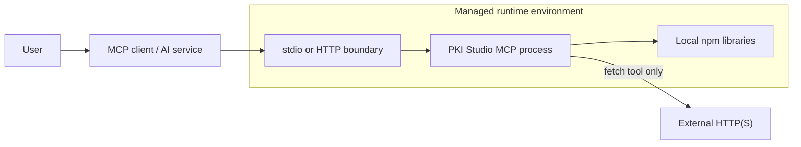

# Security Design

## 1. Security Principles

PKI Studio MCP is designed for local-first use. Private keys, PKCS#12/PFX data, passwords, and internal certificates must be treated as highly sensitive. The server does not persist input, but the MCP client, AI service, chat history, terminal logs, or reverse proxy may retain requests and responses.

External communication is separated from normal processing and is allowed only when `fetch_certificate_network_resources` is explicitly called.

## 2. Protected Assets

- PKCS#8 private keys
- SPKI public keys and key metadata
- PKCS#12/PFX data and passwords
- Production and internal X.509 certificates, CSRs, CRLs, and OCSP data
- Generated private keys, CSRs, and self-signed certificates
- HTTP Bearer tokens
- MCP requests and responses, and logs or conversations that contain them

## 3. Trust Boundaries



The stdio topology assumes the client and server process are inside the trust boundary of the same user and device. In the HTTP topology, the network, reverse proxy, authentication, CORS, logging, and outbound connectivity become additional trust boundaries.

## 4. Local Processing and External Communication

In the current implementation, `fetch_certificate_network_resources` is the only MCP tool that performs external HTTP(S) requests. ASN.1 parsing, certificate parsing, OID processing, key operations, CSR/certificate generation, PKCS#12 operations, ASN.1 generation, and type identification all run inside the server process.

`parse_certificate` returns URLs and retrieval plans found in a certificate but does not perform network access. The workflow prompt also tells the AI assistant not to use the retrieval tool unless the user explicitly permits it. Final tool-authorization policy must still be enforced by the MCP client or deployment environment.

## 5. External Retrieval Protections

`src/safe-fetch.ts` assumes that URLs embedded in certificates may be attacker-controlled and applies the following checks:

1. Parse the URL and reject every scheme except `http:` and `https:`.
2. Restrict ports to 80 and 443.
3. Resolve the hostname and reject private, loopback, link-local, reserved, multicast, and similar IP ranges.
4. Resolve again before connecting and pin the selected public IP through a custom `lookup` callback.
5. Repeat the same URL and IP checks for every redirect target.
6. Limit redirects to three by default.
7. Enforce a per-resource size limit against both Content-Length and bytes actually received.
8. Apply a per-resource timeout.

Targets are restricted to plans derived from the certificate. This is not a general-purpose fetch tool that accepts arbitrary URLs: the `urls` argument can only narrow the URLs already present in the plans.

This layer is one part of defense in depth. Shared and production deployments should also enforce outbound destination controls, DNS controls, proxies, and firewall policy at the network layer.

## 6. HTTP Ingress Controls

| Control | Current behavior | Operational assessment |
| --- | --- | --- |
| Bind address | Defaults to `127.0.0.1` | Safer for local use; Docker explicitly uses `0.0.0.0` |
| Bearer authentication | Exact-match check only when a token is configured | Required in shared environments; no token issuance or revocation is built in |
| CORS | Defaults to `*` when unset | Restrict allowed origins in browser-reachable shared environments |
| Content-Length limit | Checks the declared header value when configured | Does not limit actual received bytes for chunked or headerless requests |
| Request timeout | Applied to the Node.js HTTP server when configured | Set it in shared environments and enforce an upstream timeout too |
| TLS | Not built in | Terminate HTTPS at a reverse proxy or gateway |
| Rate limiting | Not built in | Implement upstream in shared environments |
| Health endpoints | Unauthenticated | They expose no sensitive content, but deployment policy determines their visibility |

`PKISTUDIOMCP_HTTP_MAX_CONTENT_LENGTH` checks only the `Content-Length` header, so it is not a complete request-body limit for untrusted HTTP clients. Always enforce a streamed request-size limit at a reverse proxy or gateway.

## 7. Sensitive Data Handling

- `generate_key_pair`, `read_pkcs12`, `write_pkcs12`, and similar tools include private keys or PFX bytes in their results. Do not log complete results.
- Do not record PFX passwords or HTTP Bearer tokens in source code, shell history, issues, chat, or CI logs.
- Run sensitive workloads through local stdio or a controlled private HTTP environment.
- Do not enable `includeDer` unless necessary; reduce transfer volume and exposure by returning previews where possible.
- The caller is responsible for storage, access permissions, and secure deletion of generated artifacts.
- Unless the user explicitly asks for exported material, an AI assistant should not repeat private key bytes in its final response.

## 8. Public Demo Environment

The Azure Container Apps endpoint documented in the Wiki is intended only for demonstrations and smoke tests.

```text
https://pkistudiomcp.blackfield-fee115fa.japaneast.azurecontainerapps.io/mcp
```

Do not submit private keys, production or internal certificates, sensitive PFX files, or real passwords. Run real workloads locally or in an environment where your organization controls authentication, access policy, log retention, and outbound connectivity.

## 9. Known Residual Risks

- The built-in HTTP server does not provide TLS, rate limiting, complete request-body limits, or structured audit logs.
- `healthz` and `readyz` return the same fixed response and do not check library readiness or external services.
- Large or complex ASN.1 and PKI input may consume substantial CPU and memory. Some tool schemas have count and depth limits, but there is no shared input-size limit across every tool.
- CORS defaults to `*`, and Bearer authentication is optional. The built-in defaults are not suitable for direct exposure to the internet.
- Application-layer SSRF protections do not replace network controls or guarantee complete coverage of future IP classifications and protocol behavior.
- The server cannot control data retention by the user's MCP client or AI service.

## 10. Recommended Deployment Profiles

### Personal or Sensitive Processing

- Use stdio.
- Process data on the local device.
- Review retention behavior for MCP client conversation history and logs.
- Permit the external retrieval tool only when needed.

### Shared Internal Service

- Deploy HTTP on a private network.
- Require a Bearer token or stronger upstream authentication.
- Restrict CORS to necessary origins.
- Enforce TLS, request size, rate, timeout, and audit logging at the gateway.
- Restrict outbound connectivity to the CDP/AIA/OCSP destinations required by the workload.

### Public Demo

- Accept only non-sensitive samples.
- Use short retention periods and minimal logging.
- Add authentication, rate limiting, request limits, and outbound connectivity controls.
- Clearly state that the environment is not for production use.
